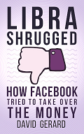
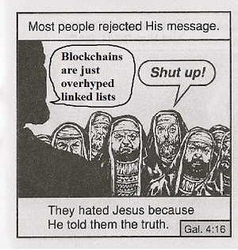
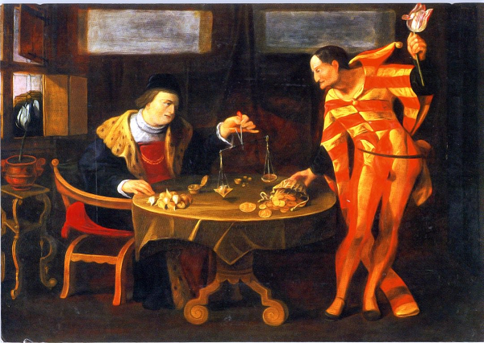
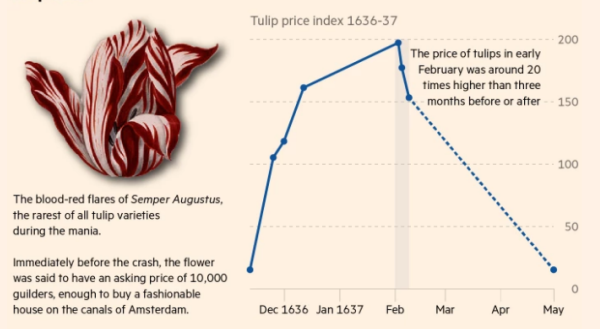
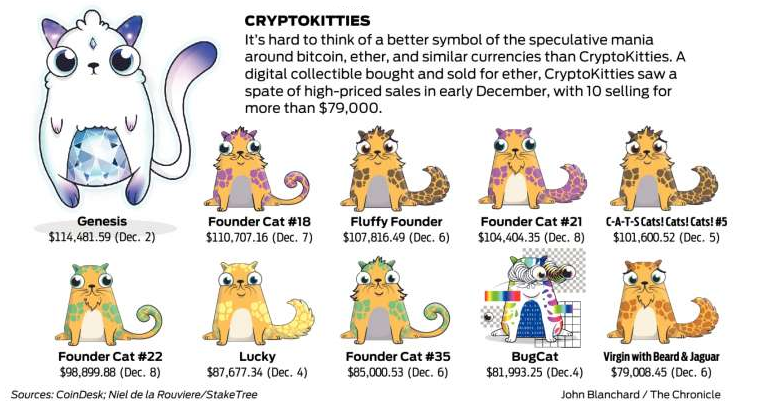
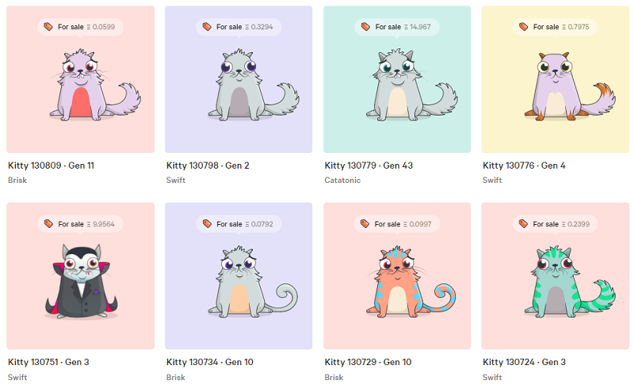

Mining Digital Gold one Block at a Time?! • Don't Expect to Get Insanely Rich (Quick) • Tulips :tulip::tulip::tulip: (like Blockchains) are Great and Gorgeous (and will Endure)  

```ruby
b0 = Block.first(
        { from: "Dutchgrown", to: "Vincent", what: "Tulip Bloemendaal Sunset", qty: 10 },
        { from: "Keukenhof",  to: "Anne",    what: "Tulip Semper Augustus",    qty: 7  } )

b1 = Block.next( b0,
        { from: "Flowers",    to: "Ruben",   what: "Tulip Admiral van Eijck",  qty: 5  },
        { from: "Vicent",     to: "Anne",    what: "Tulip Bloemendaal Sunset", qty: 3  },
        { from: "Anne",       to: "Julia",   what: "Tulip Semper Augustus",    qty: 1  },
        { from: "Julia",      to: "Luuk",    what: "Tulip Semper Augustus",    qty: 1  } )
...
```

(Source: [`blockchain_with_transactions.rb`](blockchain.rb/blockchain_with_transactions.rb))


# Awesome Blockchains

A collection about awesome blockchains - open distributed databases w/ crypto hashes incl. git ;-).  Blockchains are the new tulips :tulip::tulip::tulip:.

Contents:

- [Frequently Asked Questions (F.A.Q.s) & Answers](#frequently-asked-questions-faqs--answers)
- [Do-It-Yourself (DIY) - Build Your Own Blockchain](#do-it-yourself-diy---build-your-own-blockchain)
  - [Python](#python) • [Ruby](#ruby) • [JavaScript](#javascript) • [Java](#java) • [Go](#go)
- [Blockchain Articles](#blockchain-articles)
- [Blockchain Books](#blockchain-books)
- [Blockchain (Lite) Crypto Hash Libraries](#blockchain-lite-crypto-hash-libraries)
- [Git, Git, Git - The Stupid Content Tracker with Crypto Hashes](#git-git-git---the-stupid-content-tracker-with-crypto-hashes)
- [Classic Tulip Mania](#classic-tulip-mania)
- [Awesome Awesomeness](#awesome-awesomeness)


## What's News?

The Open Blockchains Book of the Year 2020 Award Goes To...


[**Libra Shrugged: How Facebook Tried to Take Over the Money**](https://davidgerard.co.uk/blockchain/libra/) 
by David Gerard, November 2020, 182 Pages --
_Introduction: Taking over the money  ++
A user's guide to Libra   ++
The genesis of Libra: Beller's blockchain ++
To launch a Libra: Let’s start a crypto  ++
Bitcoin: why Libra is like this  ++
The Libra White Papers  ++
Banking the unbanked  ++
The Libra Reserve plan and economic stability ++
Libra, privacy and your digital identity  ++
The regulators recoil in horror  ++
David Marcus before the US House and Senate ++
July to September 2019: Libra runs the gauntlet  ++
October 2019: Libra's bad month  ++
Mark Zuckerberg before the US House  ++
November 2019: The comedown  ++
Central bank digital currencies  ++
Epilogue: Libra 2.0: not dead yet  ++
Appendix: 2010–2013: The rise and fall of Facebook Credits_


For more about Diem (formerly Libra), see the [Awesome Diem (formerly Libra) and Move page »](https://github.com/openblockchains/awesome-diem)  


## Frequently Asked Questions (F.A.Q.s) & Answers


**Q: What's a Blockchain?**

A: A blockchain is a distributed database with a list (that is, chain) of records (that is, blocks) linked and secured by
digital fingerprints (that is, cryptho hashes).
Example from [`blockchain.rb`](blockchain.rb/blockchain.rb):

```
[#<Block:0x1eed2a0
  @timestamp     = 1637-09-15 20:52:38,
  @data          = "Genesis",
  @previous_hash = "0000000000000000000000000000000000000000000000000000000000000000",
  @hash          = "edbd4e11e69bc399a9ccd8faaea44fb27410fe8e3023bb9462450a0a9c4caa1b">,
 #<Block:0x1eec9a0
  @timestamp     = 1637-09-15 21:02:38,
  @data          = "Transaction Data...",
  @previous_hash = "edbd4e11e69bc399a9ccd8faaea44fb27410fe8e3023bb9462450a0a9c4caa1b",
  @hash          = "eb8ecbf6d5870763ae246e37539d82e37052cb32f88bb8c59971f9978e437743">,
 #<Block:0x1eec838
  @timestamp     = 1637-09-15 21:12:38,
  @data          = "Transaction Data......",
  @previous_hash = "eb8ecbf6d5870763ae246e37539d82e37052cb32f88bb8c59971f9978e437743",
  @hash          = "be50017ee4bbcb33844b3dc2b7c4e476d46569b5df5762d14ceba9355f0a85f4">,
  ...
```




**Q: What's a Hash? What's a (One-Way) Crypto(graphic) Hash Digest Checksum**?

A: A hash e.g. `eb8ecbf6d5870763ae246e37539d82e37052cb32f88bb8c59971f9978e437743`
is a small digest checksum calculated
with a one-way crypto(graphic) hash digest checksum function
e.g. SHA256 (Secure Hash Algorithm 256 Bits)
from the data. Example from [`blockchain.rb`](blockchain.rb/blockchain.rb):

```ruby
def calc_hash
  sha = Digest::SHA256.new
  sha.update( @timestamp.to_s + @previous_hash + @data )
  sha.hexdigest   ## returns "eb8ecbf6d5870763ae246e37539d82e37052cb32f88bb8c59971f9978e437743"
end
```

A blockchain uses

- the block timestamp (e.g. `1637-09-15 20:52:38`) and
- the hash from the previous block (e.g. `edbd4e11e69bc399a9ccd8faaea44fb27410fe8e3023bb9462450a0a9c4caa1b`) and finally
- the block data (e.g. `Transaction Data...`)

to calculate the new hash digest checksum, that is, the hash
e.g. `be50017ee4bbcb33844b3dc2b7c4e476d46569b5df5762d14ceba9355f0a85f4`.


**Q: What's a Merkle Tree?**

A: A Merkle tree is a hash tree named after Ralph Merkle who patented the concept in 1979
(the patent expired in 2002). A hash tree is a generalization of hash lists or hash chains where every leaf node (in the tree) is labelled with a data block and every non-leaf node (in the tree)
is labelled with the crypto(graphic) hash of the labels of its child nodes. For more see the [Merkle tree](https://en.wikipedia.org/wiki/Merkle_tree) Wikipedia Article.

Note: By adding crypto(graphic) hash functions you can "merkelize" any data structure.


**Q: What's a Merkelized DAG (Directed Acyclic Graph)?**

A: It's a blockchain secured by crypto(graphic) hashes that uses a directed acyclic graph data structure (instead of linear "classic" linked list).

Note: Git uses merkelized dag (directed acyclic graph)s for its blockchains.


**Q: Is the Git Repo a Blockchain?**

A: Yes, every branch in the git repo is a blockchain.
The "classic" Satoshi-blockchain is like a git repo with a single master branch (only).


## Do-It-Yourself (DIY) - Build Your Own Blockchain


[Python](#python) •
[Ruby](#ruby) •
[JavaScript](#javascript) •
[Java](#java) •
[Go](#go)


### Python

**Let's Build the Tiniest Blockchain in Python Series** by Gerald Nash

- [**Let's Build the Tiniest Blockchain In Less Than 50 Lines of Python (Part 1)**](https://medium.com/crypto-currently/lets-build-the-tiniest-blockchain-e70965a248b), July 2016
- [**Let's Make the Tiniest Blockchain Bigger With More Lines of Python (Part 2)**](https://medium.com/crypto-currently/lets-make-the-tiniest-blockchain-bigger-ac360a328f4d), July 2016

<!-- break -->

[**Build Your Own Blockchain: A Python Tutorial**](http://ecomunsing.com/build-your-own-blockchain)
by Eric Munsing, March 2017, [(Source)](https://github.com/emunsing/tutorials/blob/master/BuildYourOwnBlockchain.ipynb)


[**Learn Blockchains by Building One (in Python)**](https://hackernoon.com/learn-blockchains-by-building-one-117428612f46)
by Daniel van Flymen, September 2017, [(Source)](https://github.com/dvf/blockchain) -- The fastest way to learn how Blockchains work is to build one


**Build Your Own Blockchain (in Python 3) Series** by Jack Schultz, [(Source)](https://github.com/jackschultz/jbc)

- [**Part 1: Creating, Storing, Syncing, Displaying, Mining, and Proving Work**](https://bigishdata.com/2017/10/17/write-your-own-blockchain-part-1-creating-storing-syncing-displaying-mining-and-proving-work/), October 2017
- [**Part 2: Syncing Chains From Different Nodes**](https://bigishdata.com/2017/10/27/build-your-own-blockchain-part-2-syncing-chains-from-different-nodes/), October 2017
- [**Part 3: Writing Nodes that Mine and Talk**](https://bigishdata.com/2017/11/02/build-your-own-blockchain-part-3-writing-nodes-that-mine/), November 2017

<!-- break -->

[**A Practical Introduction to Blockchain with Python**](http://adilmoujahid.com/posts/2018/03/intro-blockchain-bitcoin-python/)
by Adil Moujahid, March 2018, [(Source)](https://github.com/adilmoujahid/blockchain-python-tutorial)


### Ruby

[**How Does Bitcoin Force Consensus Among Byzantine Generals?**](http://www.akitaonrails.com/2017/11/01/how-does-bitcoin-force-consensus-among-byzantine-generals) by Fabio Akita, November 2017

[**blockchain-lite - Build your own blockchains with crypto hashes; revolutionize the world with blockchains, blockchains, blockchains one block at a time!**](https://planetruby.github.io/calendar/advent2017/01-blockchain-lite) by Gerald Bauer, Ruby Advent Calendar 2017 / Day 1, December 2017

[**merkletree library - Build Your Own Crypto Hash Trees; Grow Your Own Money on Trees**](https://planetruby.github.io/calendar/advent2017/19-merkletree.html) by Gerald Bauer, Ruby Advent Calendar 2017 / Day 19, December 2017

[**centralbank command line tool (and library) - Print Your Own Money / Cryptocurrency; Run Your Own Federated Central Bank Nodes on the Blockchain Peer-to-Peer over HTTP**](https://planetruby.github.io/calendar/advent2017/24-centralbank.html) by Gerald Bauer, Ruby Advent Calendar 2017 / Day 24, December 2017


### Crystal

[**Write your own blockchain and Proof-of-Work (PoW) algorithm using Crystal**](https://medium.com/@bradford_hamilton/write-your-own-blockchain-and-pow-algorithm-using-crystal-d53d5d9d0c52) by Bradford Lamson-Scribner, May 2018,
[(Source)](https://github.com/bradford-hamilton/crystal-blockchain)


### JavaScript

[**Writing a Tiny Blockchain in JavaScript**](https://www.savjee.be/2017/07/Writing-tiny-blockchain-in-JavaScript/)
by Xavier Decuyper, July 2017

[**Node.js Blockchain Imlementation: BrewChain: Chain+WebSockets+HTTP Server**](http://www.darrenbeck.co.uk/blockchain/nodejs/nodejscrypto/) by Darren Beck, November 2017, [(Source)](https://github.com/dbbddb/BrewChain) -- Protecting the tea making ledger from unscrupulous colleagues

[**Build your own Blockchain in Javascript/Visualization of Blockchains**](https://github.com/nambrot/blockchain-in-js) by Nam Chu Hoai,  January 2018


### TypeScript

[**Naivecoin: a tutorial for building a cryptocurrency**](https://lhartikk.github.io) by Lauri Hartikka, [(Source)](https://github.com/lhartikk/naivecoin)


### Java

[**Creating Your First Blockchain with Java, Part 1**](https://medium.com/programmers-blockchain/create-simple-blockchain-java-tutorial-from-scratch-6eeed3cb03fa) by Kass, December 2017, [(Source)](https://github.com/CryptoKass/NoobChain-Tutorial-Part-1)

### Kotlin

[**Let's implement a cryptocurrency in Kotlin**](https://medium.com/@vasilyf/lets-implement-a-cryptocurrency-in-kotlin-part-1-blockchain-8704069f8580) by Vasily Fomin, July 2018,
[(Source)](https://github.com/VasilyFomin/kCoin)


### SQL

[**Blockchain by Example in SQL Server**](https://medium.com/@benjaminsky/blockchain-by-example-in-sql-server-8376b410128) by Benjamin Campbell, December 2017, [(Source)](https://github.com/benjaminsky/BlockchainMessenger)


### Rust

**Building Blockchain in Rust Series** by Jacob Lindahl, GeekLaunch, [(Source)](https://github.com/GeekLaunch/blockchain-rust), [(Slide Decks in PDF)](https://github.com/GeekLaunch/slides)
- [**Part 1: Blocks and Hashing**](https://medium.com/geeklaunch/blockchain-in-rust-01-blocks-hashing-4192f2265d3d), January 2019
- [**Part 2: Mining**](https://medium.com/geeklaunch/blockchain-in-rust-02-mining-companion-guide-9106b7a7696d), January 2019
- [**Part 3: Chains and Checks**](https://medium.com/geeklaunch/blockchain-in-rust-03-chains-checks-companion-guide-2714e1a76654), January 2019

### Go

**Building Blockchain in Go Series** by Ivan Kuznetsov, [(Source)](https://github.com/Jeiwan/blockchain_go)

- [**Part 1: Basic Prototype**](https://jeiwan.cc/posts/building-blockchain-in-go-part-1/), August 2017
- [**Part 2: Proof-of-Work**](https://jeiwan.cc/posts/building-blockchain-in-go-part-2/), August 2017
- [**Part 3: Persistence and CLI**](https://jeiwan.cc/posts/building-blockchain-in-go-part-3/), August 2017
- [**Part 4: Transactions 1**](https://jeiwan.cc/posts/building-blockchain-in-go-part-4/), September 2017
- [**Part 5: Addresses**](https://jeiwan.cc/posts/building-blockchain-in-go-part-5/), September 2017
- [**Part 6: Transactions 2**](https://jeiwan.cc/posts/building-blockchain-in-go-part-6/), September 2017
- [**Part 7: Network**](https://jeiwan.cc/posts/building-blockchain-in-go-part-7/), October 2017

<!-- break -->

Blockchain Series in Go by by Coral Health [(Source)](https://github.com/mycoralhealth/blockchain-tutorial)

- [**Code your own blockchain in less than 200 lines of Go!**](https://medium.com/@mycoralhealth/code-your-own-blockchain-in-less-than-200-lines-of-go-e296282bcffc) by Coral Health, January 2018
- [**Part 2: Networking — Code your own blockchain in less than 200 lines of Go!**](https://medium.com/@mycoralhealth/part-2-networking-code-your-own-blockchain-in-less-than-200-lines-of-go-17fe1dad46e1) by Coral Health, February 2018
- [**Code your own blockchain mining algorithm in Go!**](https://medium.com/@mycoralhealth/code-your-own-blockchain-mining-algorithm-in-go-82c6a71aba1f) by Coral Health, March 2018


<!--
  it's more about bitcoin (and not about blockchain really)
### C#

[**Programming The Blockchain in C#**](https://programmingblockchain.gitbooks.io/programmingblockchain/)
-->


### Talk Notes

- [**Blockchain! Blockchain! Blockchain! - Build Your Own Blockchains in JavaScript from Zero (Scratch)**](https://github.com/geraldb/talks/blob/master/blockchain.md) by Gerald Bauer, Vienna.js, September 2017
- [**Blockchain! Blockchain! Blockchain! - Build Your Own Blockchains in Ruby from Zero (Scratch)**](https://github.com/geraldb/talks/blob/master/blockchain_ruby.md) by Gerald Bauer, Vienna.rb, Dezember 2017
- [**Blockchain vs (Hyper) Ledger -- Inside (Hyper) Ledger Lite - Add Transactions One Block at a Time and Balance the Accounts (Books)**](https://github.com/geraldb/talks/blob/master/hyperledger.md) by Gerald Bauer, Hyperledger Vienna, March 2018
- [**Blockchain! Blockchain! Blockchain! - Build Your Own Blockchains in Go from Zero (Scratch)**](https://github.com/geraldb/talks/blob/master/blockchain_go.md) by Gerald Bauer, Vienna.go, April 2018


### More

See [**Build your own Blockchain / Cryptocurrency**](https://github.com/danistefanovic/build-your-own-x#build-your-own-blockchain--cryptocurrency) @ Build your own (insert technology here)


### Samples

#### Blockchain from Scratch - Ruby Version

```ruby
class Block

  attr_reader :timestamp
  attr_reader :data
  attr_reader :previous_hash
  attr_reader :hash

  def initialize(data, previous_hash)
    @timestamp     = Time.now
    @data          = data
    @previous_hash = previous_hash
    @hash          = calc_hash
  end

  def self.first( data="Genesis" )    # create genesis (big bang! first) block
    ## note: uses all zero for previous_hash ("0")
    Block.new( data, "0000000000000000000000000000000000000000000000000000000000000000" )
  end

  def self.next( previous, data="Transaction Data..." )
    Block.new( data, previous.hash )
  end

private

  def calc_hash
    sha = Digest::SHA256.new
    sha.update( @timestamp.to_s + @previous_hash + @data )
    sha.hexdigest
  end

end  # class Block


#####
## let's get started
##   build a blockchain a block at a time

b0 = Block.first( "Genesis" )
b1 = Block.next( b0, "Transaction Data..." )
b2 = Block.next( b1, "Transaction Data......" )
b3 = Block.next( b2, "More Transaction Data..." )

blockchain = [b0, b1, b2, b3]

pp blockchain

```

(Source: [`blockchain.rb`](blockchain.rb/blockchain.rb))

will pretty print (pp) something like:

```
[#<Block:0x1eed2a0
  @timestamp     = 1637-09-15 20:52:38,
  @data          = "Genesis",
  @previous_hash = "0000000000000000000000000000000000000000000000000000000000000000",
  @hash          = "edbd4e11e69bc399a9ccd8faaea44fb27410fe8e3023bb9462450a0a9c4caa1b">,
 #<Block:0x1eec9a0
  @timestamp     = 1637-09-15 21:02:38,
  @data          = "Transaction Data...",
  @previous_hash = "edbd4e11e69bc399a9ccd8faaea44fb27410fe8e3023bb9462450a0a9c4caa1b",
  @hash          = "eb8ecbf6d5870763ae246e37539d82e37052cb32f88bb8c59971f9978e437743">,
 #<Block:0x1eec838
  @timestamp     = 1637-09-15 21:12:38,
  @data          = "Transaction Data......",
  @previous_hash = "eb8ecbf6d5870763ae246e37539d82e37052cb32f88bb8c59971f9978e437743",
  @hash          = "be50017ee4bbcb33844b3dc2b7c4e476d46569b5df5762d14ceba9355f0a85f4">,
 #<Block:0x1eec6d0
  @timestamp     = 1637-09-15 21:22:38,
  @data          = "More Transaction Data...",
  @previous_hash = "be50017ee4bbcb33844b3dc2b7c4e476d46569b5df5762d14ceba9355f0a85f4",
  @hash          = "5ee2981606328abfe0c3b1171440f0df746c1e1f8b3b56c351727f7da7ae5d8d">]
```


Comments from the [reddit ruby posting](https://www.reddit.com/r/ruby/comments/70c30f/build_your_own_blockchain_in_20_lines_of_ruby/):

> Wait, so a blockchain is just a linked list?
>
>> No. A linked list is only required to have a reference to the previous element, a block must
>> have an identifier depending on the previous block's identifier, meaning that you cannot
>> replace a block without recomputing every single block that comes after.
>> In this implementation that happens as the previous digest is input in the calc_hash method.


**What about Proof of Work / Waste?**

Let's add a proof of work / waste to the blockchain. In the classic blockchain you have to compute a block hash that starts with leading zeros (`00`). The more leading zeros the harder (more difficult) to compute. Let's keep it easy to compute with two leading zeros (`00`), that is, 16^2 = 256 possibilites (^1,2). Three leading zeros (`000`) would be 16^3 = 4_096 possibilites and four zeros (`0000`) would be 16^4 = 65_536 and so on.

(^1): 16 possibilties because it's a hex or hexadecimal or base 16 number, that is, `0` `1` `2` `3` `4` `6` `7` `8` `9` `a` (10) `b` (11) `c` (12) `d` (13) `e` (14) `f` (15).

(^2): A random secure hash algorithm needs on average 256 tries (might be lets say 305 tries, for example, because it's NOT a perfect statistic distribution of possibilities).


Example:

```ruby
def compute_hash_with_proof_of_work( difficulty="00" )
  nonce = 0
  loop do
    hash = calc_hash_with_nonce( nonce )
    if hash.start_with?( difficulty )  
      return [nonce,hash]     ## bingo! proof of work if hash starts with leading zeros (00)
    else
      nonce += 1              ## keep trying (and trying and trying)
    end
  end
end

def calc_hash_with_nonce( nonce=0 )
  sha = Digest::SHA256.new
  sha.update( nonce.to_s + @timestamp.to_s + @previous_hash + @data )
  sha.hexdigest
end
```

(Source: [`blockchain_with_proof_of_work.rb`](blockchain.rb/blockchain_with_proof_of_work.rb))

Let's rerun the sample with the proof of work machinery added.
Now the sample will pretty print (pp) something like:

```
[#<Block:0x1e204f0
  @timestamp     = 1637-09-20 20:13:38,
  @data          = "Genesis",
  @previous_hash = "0000000000000000000000000000000000000000000000000000000000000000",
  @nonce         = 242,
  @hash          = "00b8e77e27378f9aa0afbcea3a2882bb62f6663771dee053364beb1887e18bcf">,
 #<Block:0x1e56e20
  @timestamp     = 1637-09-20 20:23:38,
  @data          = "Transaction Data...",
  @previous_hash = "00b8e77e27378f9aa0afbcea3a2882bb62f6663771dee053364beb1887e18bcf",
  @nonce         = 46,
  @hash          = "00aae8d2e9387e13c71b33f8cd205d336ac250d2828011f5970062912985a9af">,
 #<Block:0x1e2bd58
  @timestamp     = 1637-09-20 20:33:38,
  @data          = "Transaction Data......",
  @previous_hash = "00aae8d2e9387e13c71b33f8cd205d336ac250d2828011f5970062912985a9af",
  @nonce         = 350,
  @hash          = "00ea45e0f4683c3bec4364f349ee2b6816be0c9fd95cfd5ffcc6ed572c62f190">,
 #<Block:0x1fa8338
  @timestamp     = 1637-09-20 20:43:38,
  @data          = "More Transaction Data...",
  @previous_hash = "00ea45e0f4683c3bec4364f349ee2b6816be0c9fd95cfd5ffcc6ed572c62f190",
  @nonce         = 59,
  @hash          = "00436f0fca677652963e904ce4c624606a255946b921132d5b1f70f7d86c4ab8">]
```

See the difference? All hashes now start with leading zeros (`00`) and the nonce is the random "lucky number"
that makes it happen. That's the magic behind the proof of work.


##### Blockchain from Scratch - JavaScript Version

```js
class Block {

  constructor(data, previousHash) {
    this.timestamp    = new Date()
    this.data         = data
    this.previousHash = previousHash
    this.hash         = this.calcHash()
  }

  calcHash() {
    var sha = SHA256.create()
    sha.update( this.timestamp.toString() + this.previousHash + this.data )
    return sha.hex()
  }

  static first( data="Genesis" ) {    // create genesis (big bang! first) block
    // uses all-zero previousHash
    return new Block( data, "0000000000000000000000000000000000000000000000000000000000000000" )
  }

  static next( previous, data="Transaction Data..." ) {
    return new Block( data, previous.hash )
  }
}


//////
// let's get started
//   build a blockchain a block at a time

b0 = Block.first( "Genesis" )
b1 = Block.next( b0, "Transaction Data..." )
b2 = Block.next( b1, "Transaction Data......" )
b3 = Block.next( b2, "More Transaction Data..." )


blockchain = [b0, b1, b2, b3]

console.log( blockchain )
```

(Source: [`blockchain.js`](blockchain.js/blockchain.js))

will log something like:

```
[ Block {
     timestamp    : 1637-09-18 08:25:54,
     data         : 'Genesis',
     previousHash : '0000000000000000000000000000000000000000000000000000000000000000',
     hash         : 'c396de4c03ddb5275661982adc75ce5fc5905d2a2457d1266c74436c1f3c50f1' },
   Block {
     timestamp    : 1637-09-18 08:35:54,
     data         : 'Transaction Data...',
     previousHash : 'c396de4c03ddb5275661982adc75ce5fc5905d2a2457d1266c74436c1f3c50f1',
     hash         : '493131e09c069645c82795c96e4715cea0f5558be514b5096d853a5b9899154a' },
   Block {
     timestamp    : 1637-09-18 08:45:54,
     data         : 'Transaction Data......',
     previousHash : '493131e09c069645c82795c96e4715cea0f5558be514b5096d853a5b9899154a',
     hash         : '97aa3cb5052615d60ff8e6b41bef606562588c4874f011970ac2f218e2f0f4a8' },
   Block {
     timestamp    : 1637-09-18 08:55:54,
     data         : 'More Transaction Data...',
     previousHash : '97aa3cb5052615d60ff8e6b41bef606562588c4874f011970ac2f218e2f0f4a8',
     hash         : 'e10e020f832e46c2b60e1c3c0412bd370b2fde5f0f782c16eb87d0313ea0d3a3' } ]
```


## Blockchain Articles

[**Reflections on the Blockchain**](http://rufuspollock.com/2016/07/02/reflections-on-the-blockchain) by Rufus Pollock (Open Knowledge Foundation), July 2016 --
_The DAO: Code is not Law – and It’s Dangerous to Think So ++
The Internet changed the world - surely the Blockchain will too? ++
Gold-rush or Internet-rush? ++
Governance Matters in Bitcoin ++
The Myth of a Costless, Ownerless Network ++
Lessons from History_

[**On the Dangers of a Blockchain Monoculture**](https://tonyarcieri.com/on-the-dangers-of-a-blockchain-monoculture) by Tony Arcieri, January 2016 --
_The Bitcoin blockchain: the world's worst database ++
Next-generation protocols ++
Decentralized ledger protocols ++
Bitcoin-NG ++
Blockchain! Blockchain! Blockchain! ++
The great decentralized database in the sky_


[**I Don’t Believe in Blockchain**](https://www.tbray.org/ongoing/When/201x/2017/05/13/Not-Believing-in-Blockchain) by Tim Bray, May 2017


[**Minimum Viable Blockchain**](https://www.igvita.com/2014/05/05/minimum-viable-block-chain/) by Ilya Grigorik, May 2014 --
_Securing transactions with triple-entry bookkeeping ++
Securing transactions with PKI ++
Balance = Σ(receipts) ++
Multi-party transfers & verification ++
Double-spending and distributed consensus -
 Requirements for a distributed consensus network;
 Protecting the network from Sybil attacks;
Proof-of-work as a participation requirement ++
Building the minimum viable blockchain -
 Adding "blocks" & transaction fee incentives;
 Racing to claim the transaction fees;
 Resolving chain conflicts;
 Blocks are never final ++
Properties of the (minimum viable) blockchain_

[**Blockchains by analogies and applications: How blockchain compares to Git, Raft, and other technologies.**](https://www.oreilly.com/ideas/blockchains-by-analogies-and-applications)
by Kieren James-Lubin, January 2016 --
_Blockchains are databases ++
Understanding transactions ++
Persistent, replicated databases (related technology: Git) ++
Peer-to-peer networks (related technology: BitTorrent) ++
Distributed consensus (related technology: distributed databases, Raft) ++
Minting new coins (mining) ++
Embedded identities (related technology: TLS) ++
Smart contracts: Like SQL expressions & triggers ++
What can we really do with blockchains?_


## Blockchain Books

[**Attack of the 50 Foot Blockchain: Bitcoin, Blockchain, Ethereum & Smart Contracts**](https://davidgerard.co.uk/blockchain/table-of-contents/) by David Gerard, London, 2017 --
_What is a bitcoin? ++
The Bitcoin ideology ++
The incredible promises of Bitcoin! ++
Early Bitcoin: the rise to the first bubble ++
How Bitcoin mining centralised ++
Who is Satoshi Nakamoto? ++
Spending bitcoins in 2017 ++
Trading bitcoins in 2017: the second crypto bubble ++
Altcoins ++
Smart contracts, stupid humans ++
Business bafflegab, but on the Blockchain ++
Case study: Why you can’t put the music industry on a blockchain_


[**Mastering Bitcoin - Programming the Open Blockchain**](https://github.com/bitcoinbook/bitcoinbook/blob/second_edition/ch09.asciidoc) 2nd Edition,
by Andreas M. Antonopoulos, 2017 - FREE (Online Source Version) --
_What Is Bitcoin? ++
How Bitcoin Works ++
Bitcoin Core: The Reference Implementation ++
Keys, Addresses ++
Wallets ++
Transactions ++
Advanced Transactions and Scripting ++
The Bitcoin Network ++
The Blockchain ++
Mining and Consensus ++
Bitcoin Security ++
Blockchain Applications_

---


**BEWARE: Bitcoin is a gigantic ponzi scheme¹.
To the moon!? The new gold standard!? 
Do NOT "invest" trying to get-rich-quick HODLing. 
Why not? The bitcoin code is archaic and out-of-date.
Burn, baby, burn! Proof-of-work / waste is a global
energy environmental disaster
using 300 kW/h per bitcoin transaction (!) that's about 179 kilograms of CO₂ emissions².
Programmable money (or the internet of value) 
for all future generations with (bitcoin) script
without loops and jumps (gotos) and all "stateless"!? LOL.**

¹: (Source: [Best of Bitcoin Maximalist - Scammers, Morons, Clowns, Shills & BagHODLers - Inside The New New Crypto Ponzi Economics](https://bitsblocks.github.io/bitcoin-maximalist))

²: Assuming let's say 0.596 kilograms of CO₂ per kW/h 
(that's the energy efficiency in Germany) that's 
about 179 kilograms of CO₂ per bitcoin transaction (300 kW/h × 0.596 kg). For more insights see the [Bitcoin Energy Consumption Index](https://digiconomist.net/bitcoin-energy-consumption).

---


[**Programming Bitcoin from Scratch**](https://github.com/jimmysong/programmingbitcoin) by Jimmy Song, 2019 - FREE (Online Source Version) -- _[Chapter 6 - Script](https://github.com/jimmysong/programmingbitcoin/blob/master/ch06.asciidoc) - How Script Works • Example Operations • Parsing the Script Fields • Combining the Script Fields • Standard Scripts • p2pk • Problems with p2pk • Solving the Problems with p2pkh • Scripts Can Be Arbitrarily Constructed • Conclusion ++_
_[Chapter 8 - Pay-to-Script Hash](https://github.com/jimmysong/programmingbitcoin/blob/master/ch08.asciidoc) - Bare Multisig • Coding OP_CHECKMULTISIG • Problems with Bare Multisig • Pay-to-Script-Hash (p2sh) • Coding p2sh • Conclusion ++_
_[Chapter 13 - Segregated Witness](https://github.com/jimmysong/programmingbitcoin/blob/master/ch13.asciidoc) - Pay-to-Witness-Pubkey-Hash (p2wpkh) • p2wpkh Transactions • p2sh-p2wpkh • Coding p2wpkh and p2sh-p2wpkh • Pay-to-Witness-Script-Hash (p2wsh) • p2sh-p2wsh • Coding p2wsh and p2sh-p2wsh • Other Improvements • Conclusion_
  

[**Programming Bitcoin Script Transaction (Crypto) Contracts Step-by-Step ( Beta / Rough Draft )**](https://github.com/openblockchains/programming-bitcoin-script)
by Gerald Bauer et al, 2019 - FREE (Online Version) --
_Let's start with building your own bitcoin stack machine from zero / scratch and let's run your own bitcoin ops (operations)..._


[**Programming Blockchains in Ruby from Scratch Step-by-Step Starting w/ Crypto Hashes... ( Beta / Rough Draft )**](https://github.com/yukimotopress/programming-blockchains-step-by-step)
by Gerald Bauer et al, 2018 - FREE (Online Version) --
_(Crypto) Hash ++
(Crypto) Block ++
(Crypto) Block with Proof-of-Work ++
Blockchain! Blockchain! Blockchain! ++
Blockchain Broken? ++
Timestamping ++
Mining, Mining, Mining - What's Your Hash Rate? ++
Bitcoin, Bitcoin, Bitcoin ++
(Crypto) Block with Transactions (Tx)_

[**Mastering Ethereum - Building Contract Services and Decentralized Apps on the Blockchain**](https://github.com/ethereumbook/ethereumbook) -
by Andreas M. Antonopoulos, Gavin Wood, 2018 - FREE (Online Source Version)
_What is Ethereum ++
Introduction ++
Ethereum Clients ++
Ethereum Testnets ++
Keys and Addresses ++
Wallets	++
Transactions ++
Contract Services ++
Tokens ++
Oracles ++
Accounting & Gas ++
EVM (Ethereum Virtual Machine) ++ 	
Consensus ++		
DevP2P (Peer-To-Peer) Protocol ++
Dev Tools and Frameworks ++
Decentralized Apps ++
Ethereum Standards (EIPs/ERCs)_


[**Building Decentralized Apps on the Ethereum Blockchain**](https://www.manning.com/books/building-ethereum-dapps) by Roberto Infante, 2018 - FREE chapter 1 --
_Understanding decentralized applications ++
The Ethereum blockchain ++
Building contract services in (JavaScript-like) Solidity ++
Running contract services on the Ethereum blockchain ++
Developing Ethereum Decentralized apps with Truffle ++
Best design and security practice_

[**Programming Crypto Blockchain Contracts Step-by-Step Book / Guide ( Beta / Rough Draft )**](https://github.com/openblockchains/programming-cryptocontracts) by Gerald Bauer et al, 2019 - FREE (Online Version) --
_Let's Start with Ponzi & Pyramid Schemes. Run Your Own Lotteries, Gambling Casinos and more on the Blockchain World Computer..._


[**Programming Cryptocurrencies and Blockchains in Ruby ( Beta / Rough Draft )**](http://yukimotopress.github.io/blockchains)
by Gerald Bauer et al, 2018 - FREE (Online Version) @ Yuki & Moto Press Bookshelf --
_Digital $$$ Alchemy - What's a Blockchain? -
How-To Turn Digital Bits Into $$$ or €€€? •
Decentralize Payments. Decentralize Transactions. Decentralize Blockchains. •
The Proof of the Pudding is ... The Bitcoin (BTC) Blockchain(s)
++
Building Blockchains from Scratch -
A Blockchain in Ruby in 20 Lines! A Blockchain is a Data Structure  •
What about Proof-of-Work? What about Consensus?   •
Find the Lucky Number - Nonce == Number Used Once
++
Adding Transactions -
The World's Worst Database - Bitcoin Blockchain Mining  •
Tulips on the Blockchain! Adding Transactions
++
Blockchain Lite -
Basic Blocks  •
Proof-of-Work Blocks  •
Transactions
++
Merkle Tree -
Build Your Own Crypto Hash Trees; Grow Your Own Money on Trees  •
What's a Merkle Tree?   •
Transactions
++
Central Bank -
Run Your Own Federated Central Bank Nodes on the Blockchain Peer-to-Peer over HTTP  •
Inside Mining - Printing Cryptos, Cryptos, Cryptos on the Blockchain
++
Awesome Crypto
++
Case Studies - Dutch Gulden  • Shilling  • CryptoKitties (and CryptoCopycats)_


[**Blockchain for Dummies, IBM Limited Edition**](https://www.ibm.com/blockchain/what-is-blockchain.html) by Manav Gupta, 2017 - FREE (Digital Download w/ Email) --
_Grasping Blockchain Fundamentals ++
Taking a Look at How Blockchain Works ++
Propelling Business with Blockchains ++
Blockchain in Action: Use Cases ++
Hyperledger, a Linux Foundation Project ++
Ten Steps to Your First Blockchain application_


[**Get Rich Quick "Business Blockchain" Bible - The Secrets of Free Easy Money**](https://github.com/bitsblocks/get-rich-quick-bible), 2018 - FREE --
_Step 1: Sell hot air. How? ++
Step 2: Pump up your tokens. How? ++
Step 3: Revolutionize the World. How?_


[**Best of Bitcoin Maximalist - Scammers, Morons, Clowns, Shills & BagHODLers - Inside The New New Crypto Ponzi Economics**](https://github.com/bitsblocks/bitcoin-maximalist) by Trolly McTrollface, et al, 2018 - FREE 

[**Crypto Facts - Decentralize Payments - Efficient, Low Cost, Fair, Clean - True or False?**](https://github.com/bitsblocks/crypto-facts) by Nouriel Roubini, David Gerard, et al, 2018 - FREE 

[**Crypto is the Mother of All Scams and (Now Busted) Bubbles - While Blockchain Is The Most Over-Hyped Technology Ever, No Better than a Spreadsheet/Database**](https://github.com/bitsblocks/crypto-bubbles) by Nouriel Roubini, 2018 - FREE 

[**IslandCoin White Paper - A Pen and Paper Cash System - How to Run a Blockchain on a Deserted Island**](https://github.com/bitsblocks/islandcoin-whitepaper)
by Tal Kol -- 
_Motivation ++
Consensus ++
Transaction and Block Specification -
Transaction format •
Block format •
Genesis block ++
References_


## Blockchain (Lite) Crypto Hash Libraries

[Ruby](#ruby) •
[JavaScript](#javascript)


### Ruby

**blockchain.lite** (github: [openblockchains/blockchain.lite.rb](https://github.com/openblockchains/blockchain.lite.rb),
gem: [blockchain-lite](https://rubygems.org/gems/blockchain-lite)) -
build your own blockchain with crypto hashes -
revolutionize the world with blockchains, blockchains, blockchains one block at a time

```ruby
require 'blockchain-lite'

b0 = Block.first( "Genesis" )
b1 = Block.next( b0, "Transaction Data..." )
b2 = Block.next( b1, "Transaction Data......" )
b3 = Block.next( b2, "More Transaction Data..." )

blockchain = [b0, b1, b2, b3]

pp blockchain   
```

will pretty print (pp) something like:

```
[#<Block:0x1eed2a0
  @timestamp     = 1637-09-15 20:52:38,
  @data          = "Genesis",
  @previous_hash = "0000000000000000000000000000000000000000000000000000000000000000",
  @hash          = "edbd4e11e69bc399a9ccd8faaea44fb27410fe8e3023bb9462450a0a9c4caa1b">,
 #<Block:0x1eec9a0
  @timestamp     = 1637-09-15 21:02:38,
  @data          = "Transaction Data...",
  @hash          = "eb8ecbf6d5870763ae246e37539d82e37052cb32f88bb8c59971f9978e437743",
  @previous_hash = "edbd4e11e69bc399a9ccd8faaea44fb27410fe8e3023bb9462450a0a9c4caa1b">,
  ...
```


### JavaScript

**blockchain.lite** (github: [openblockchains/blockchain.lite.js](https://github.com/openblockchains/blockchain.lite.js),
npm: [blockchain-lite](https://www.npmjs.com/package/blockchain-lite)) -
build your own blockchain with crypto hashes -
revolutionize the world with blockchains, blockchains, blockchains one block at a time

```js
const Blocks = require( "blockchain-lite" )

// use basic block
let Block = Blocks.basic

let b0 = Block.first( 'Genesis' )
let b1 = Block.next( b0, 'Transaction Data...' )
let b2 = Block.next( b1, 'Transaction Data......' )
let b3 = Block.next( b2, 'More Transaction Data...' )

let blockchain = [b0, b1, b2, b3]

console.log( blockchain )
```

will log something like:

```
[ Block {
    timestamp:     2017-09-25 17:03:38,
    data:         'Genesis',
    previousHash: '0000000000000000000000000000000000000000000000000000000000000000',
    hash:         '08f4fa71628c5bc6b430228738bc8c41afaf508ece0b1cf9c9cac53d02e11829' },
  Block {
    timestamp:     2017-09-25 17:13:38,
    data:         'Transaction Data...',
    previousHash: '08f4fa71628c5bc6b430228738bc8c41afaf508ece0b1cf9c9cac53d02e11829',
    hash:         '740a4aeb3441484c96d1e7f63d31b716220ccee3b6fe94547cae2afbb6010626' },
  Block {
    timestamp:     2017-09-25 17:23:38,
    data:         'Transaction Data......',
    previousHash: '740a4aeb3441484c96d1e7f63d31b716220ccee3b6fe94547cae2afbb6010626',
    hash:         '28b6892a069e2ff7f1c3128ab495d7cd9b9b1636a51a7f69db93a14b1ee6b1a7' },
  Block {
    timestamp:     2017-09-25 17:33:38,
    data:         'More Transaction Data...',
    previousHash: '28b6892a069e2ff7f1c3128ab495d7cd9b9b1636a51a7f69db93a14b1ee6b1a7',
    hash:         '4cc0329b2c0cb32e0451fa3179bd944d4cd0fcf410939172f979e9fd2aa9f5f3' } ]
```


## Git, Git, Git - The Stupid Content Tracker with Crypto Hashes

_Everything is local. Distributed is the new centralized._


### Quotes - Blockchains and Git

> Yep, that's the joke. Nobody has been able to explain to me how the "blockchain" buzzword is significantly different to "git repo".
> -- [Yaakov](https://twitter.com/yaakov_h/status/902659507255312384)
>
> But if you said "let's build a currency where all transactions are stored in a git repo"
> you wouldn't be taken seriously for even 24 hrs.
> -- [Yaakov](https://twitter.com/yaakov_h/status/902659847224664064)

> Soon explaining git like "a git repo is like a blockchain with commits instead of blocks".
> -- [Nicolás Berger](https://twitter.com/nicoberger/status/901776907418697729)
>
> "A local branch is like a state channel. It can be pushed and merged into the master blockchain at any moment."
> -- [Nicolás Berger](https://twitter.com/nicoberger/status/901777571456614400)

> The #Blockchain has changed the world. Here I make the argument that the #Blockchain is just like #git.
> -- [Jackson Kelley](https://twitter.com/sjkelleyjr/status/901464041163341824)

> `git merge [-m REF] [-g BLOB] --push`
>  Merge and push all signed commits to the blockchain.
> -- [Git Commands](https://twitter.com/git_commands/status/935574015015612416)


### Books

[**Learn Enough Git to Be Dangerous**](https://learnenough.com/git-tutorial) by Michael Hartl - FREE (Online Version) --
_Getting started ++
Backing up and sharing ++
Intermediate workflow ++
Collaborating ++
Conclusion ++
Advanced setup_


[**Pro Git**](https://git-scm.com/book) by Scott Chacon and Ben Straub, 2nd Edition, 2014 - FREE (Online Version) --
_Getting Started ++
Git Basics ++
Git Branching ++
Git on the Server ++
Distributed Git ++
GitHub ++
Git Tools ++
Customizing Git ++
Git and Other Systems ++
Git Internals ++
A1: Git in Other Environments ++
A2: Embedding Git in your Applications ++
A3: Git Commands_


> Git gets easier once you get the basic idea that branches are homeomorphic endofunctors
> mapping submanifolds of a Hilbert space.
> -- Anonymous


### Open Distributed Databases on Git

[**football.db**](https://github.com/openfootball) - open public domain football datasets (incl. clubs, national teams, leagues, match schedules, etc.)

[**world.db**](https://github.com/openmundi) - open public domain world (country) datasets

[**beer.db**](https://github.com/openbeer) - open public domain beer & brewery datasets

> Add a beer transaction to the #blockchain on #git and win a free Wiener Lager beer! Cheers. Prost.
> -- [Gerald Bauer @ Austria Codes](https://twitter.com/austriacodes/status/907240018435088384)


### Open Distributed (Hyper) Ledger Books on Git

[**Shilling (or Schilling)**](https://github.com/bitshilling/bitshilling) - Shilling on the Blockchain! - Rock-Solid Alpine Dollar from Austria

[**Tulips**](https://github.com/openblockchains/tulips) - Tulips on the Blockchain! - Learn by Example from the Real World (Anno 1637) - Buy! Sell! Hold! Enjoy the Beauty of Admiral of Admirals, Semper Augustus, and More


## Classic Tulip Mania

_A period in the Dutch Golden Age during which contract prices for bulbs of the recently introduced tulip reached extraordinarily high levels and then dramatically collapsed in February 1637._




### Quotes - Blockchains are the next Internets / Tulips

> People who compare digital tokens to tulips are essentially saying digital tokens are a bubble backed
> by nothing but pure hype and speculation.
>
> What they fail to understand is that tulips come from dirt, not a blockchain.
>
> And as we all know, blockchain is possibly the best technological innovation since the internet.
> It will have a tremendous impact on global business and society in general.
> -- [TulipToken](http://tuliptoken.com)


### Books

**Tulipomania: The Story of the World's Most Coveted Flower & the Extraordinary Passions It Aroused** by Mike Dash, 2001 --
_A Mania for Tulips ++
The Valley of Tien Shan ++
Within the Abode of Bliss ++
Stranger from the East ++
Clusius ++
Leiden ++
An Adornment to the Cleavage ++
The Tulip in the Mirror ++
Florists ++
Boom ++
At the Sign of the Golden Grape ++
The Orphans of Wouter Winkel ++
Bust ++
Goddess of Whores ++
At the Court of the Tulip King ++
Late Flowering_

**Tulipmania: Money, Honor, and Knowledge in the Dutch Golden Age** by Anne Goldgar, 2007  --
_Something Strange ++
Art & Flowers ++
Bloemisten ++
Grieving Money ++
Bad Faith ++
Cabbage Fever ++
Glossary ++
A Note on Money_




## Breaking News: CryptoKitties (Yes, Cute Little Cartoon Cats) on the Blockchain!

Collectible. Breedable. Adorable.

Collect and breed digital cats. Start meow. Buy! Sell! Hold!

Learn more @ [cryptokitties.co](https://cryptokitties.co)





<!-- note: changed pic; was:
   
  -->

Latest (and Greatest) Investment Opportunity!

> Blockchain has unlocked the magic of digital scarcity, and combining that with the power of
> making the digital goods persistent gives them a potential value that is only limited by how much
> prestige a wealthy person might place on ownership of the item.
>
> -- [Justin Poirier](https://twitter.com/tokenizedcap/status/938460753589424128)‏

> All I want for Christmas is a CryptoKitty.
>
> -- [Kayla Williams](https://twitter.com/kaylaw/status/938590748655550464)

> I got a fever. And the only prescription is more CryptoKitties.
>
> -- [Eduardo Salazar](https://twitter.com/ceduardosalazar/status/938558630663634944)

> My Gen 7 CryptoKitty #104375. The Future is Meow.
>
> -- [Anshul Dhawan](https://twitter.com/TheAnshulDhawan/status/938551642202324993)


> - Fabulous Persian Spock Gerbil Gold Cottoncandy - Extremely rare gen 5 swift virgin | 2.9 ETH
> - Rarity: 0.00264% Gen 5 JAGUAR FABULOUS GOLD DALI!! VIRGIN!
> - Rarity: 0.0015% Princess Bubblegum is now for sale! Gen 12 | Brisk | Virgin | Chartreux | Bubblegum | Otaku | Emeraldgreen | Saycheese | Mauveover | Spock - Starts ETH 20/Ends ETH 10
> - Gold ducat, Gen 5, Virgin, Swift. Very cheap
> - Cheap Gen 1 cute kittie with rare genes! Only 0.125 ETH
> - UNIQUE Virgin Peach Googly Gold Mauveover gen:2 cooldown:1 0.87992% RARE
> - SUPER CHEAP: Gerbil, Ragdoll, Scarlet, Chestnut, Cotton Candy!!! 0.02 ETH (~$14)
> - I'm giving away a Gen 1 FAST Gold for free...
>
> -- [CrypoKittiesMarket](https://www.reddit.com/r/CryptoKittiesMarket)

### Awesome CryptoKitties (and CryptoCopycats)


A collection about Awesome CryptoKitties (Yes, Cute Little Cartoon Cats) on the Blockchain! and CryptoCopycats - digital collectibles secured on a distributed public databases w/ crypto hashes. Are CryptoPuppies the new CryptoKitties? Learn by Example from the Real World (Anno 2017) - Buy! Sell! Hodl!

More @ [cryptocopycats/awesome-cryptokitties](https://github.com/cryptocopycats/awesome-cryptokitties)


## Events, Meetups, Orgs

_Revolutionize the world one country at a time. Blockchainers of the world, unite!_

- [**Blockchain Austria • Blockkette Österreich**](https://github.com/austriacodes/blockchain-austria) -- distributed centralized page for blockchain meetups & orgs in Austria (Central Europe)


## Awesome Awesomeness

_A curated list of awesome lists._

- [**Blockchain Stuff**](https://github.com/Xel/Blockchain-stuff) -- a curated list of blockchain and general cryptocurrency resources
- [**Awesome Blockchain**](https://github.com/igorbarinov/awesome-blockchain) by Igor Barinov et al -- a curated list of the bitcoin blockchain services
- [**Awesome Blockchain**](https://github.com/imbaniac/awesome-blockchain) by Tim Reznich et al -- a curated list of blockchain services and exchanges
- [**Awesome Blockchain**](https://github.com/istinspring/awesome-blockchain) by `istinspring` et al -- a curated list of awesome projects and services based on blockchain technology
- [**Awesome Coins**](https://github.com/kennethreitz/awesome-coins) by Kenneth Reitz et al -- a guide to crypto-currencies and their algos
- [**Awesome CryptoKitties (and CryptoCopycats)**](https://github.com/openblockchains/awesome-cryptokitties) by Gerald Bauer et al -- a curated list about the awesome crypto kitties and copycats
- [**Awesome Git**](https://github.com/dictcp/awesome-git) by Dick Tang et al -- a curated list of amazingly awesome Git tools, resources and shiny things
- [**Awesome**](https://github.com/sindresorhus/awesome) by Sindre Sorhus et al -- a curated list of awesome lists


## Meta

**License**


The awesome list is dedicated to the public domain. Use it as you please with no restrictions whatsoever.
